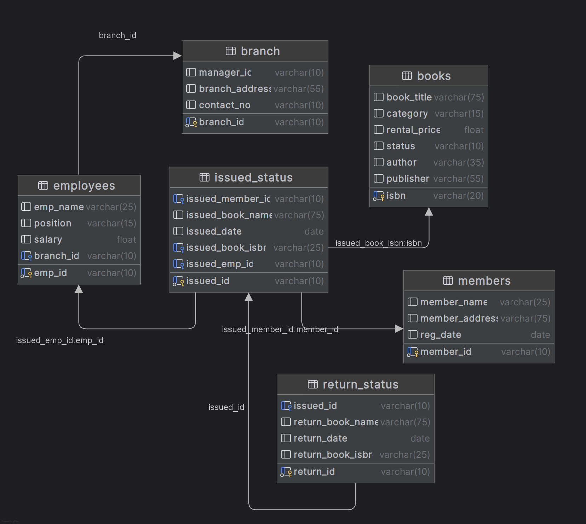

# 📚 Library Management System

This project is a hands-on implementation of a **Library Management System** using SQL. It focuses on designing a
well-structured database and performing real-world data operations. From creating and managing tables to running
advanced analytical queries, this project demonstrates strong SQL fundamentals and practical database management skills.


## 🎯 Project Objectives

* **Database Setup:** Design and build a relational database (`library_management`) with tables for branches, employees,
  members, books, issue records, and return records.
* **CRUD Operations:** Implement `CREATE`, `READ`, `UPDATE`, and `DELETE` statements to manage library data efficiently.
* **CTAS (Create Table As Select):** Use CTAS to generate new tables dynamically from existing data queries.
* **Advanced SQL Queries:** Write complex queries to extract insights—such as most borrowed books, active members, and
  branch performance.

## 🧩 Skills Demonstrated

* Database design and normalization
* SQL joins, subqueries, and aggregate functions
* Data manipulation and reporting
* Real-world query optimization

## 🧾 Project Structure

### 1. Database Setup



* **Database Creation:** Created a database named `library_management`.
* **Table Creation:** Created tables for `branches`, `employees`, `members`, `books`, `issued_status`, and
  `return_status`. Each table includes relevant columns and relationships.

#### 🧩 Database Schema

The project includes six main tables:

| Table Name      | Description                                              |
|-----------------|----------------------------------------------------------|
| `branch`        | Stores information about each library branch.            |
| `employees`     | Details of employees and their assigned branches.        |
| `members`       | Records of library members.                              |
| `books`         | Stores information about books available in the library. |
| `issued_status` | Tracks information about books issued to members.        |
| `return_status` | Tracks books returned by members.                        |

#### 🧾 SQL Snippets

```sql
-- ==========================================================
-- Step 1: Create and select the database
-- ==========================================================
DROP
DATABASE IF EXISTS library_management;
CREATE
DATABASE library_management;
USE
library_management;
    
-- ==========================================================
-- Step 2: Create 'branch' table
-- Stores information about each library branch
-- ==========================================================
DROP TABLE IF EXISTS branch;
CREATE TABLE branch
(
    branch_id      VARCHAR(10) PRIMARY KEY,
    manager_id     VARCHAR(10),
    branch_address VARCHAR(55),
    contact_no     VARCHAR(10)
);

SELECT *
FROM branch;

-- ==========================================================
-- Step 3: Create 'employees' table
-- Stores details about library employees and links them to a branch
-- ==========================================================
DROP TABLE IF EXISTS employees;
CREATE TABLE employees
(
    emp_id    VARCHAR(10) PRIMARY KEY,
    emp_name  VARCHAR(25),
    position  VARCHAR(15),
    salary    FLOAT,
    branch_id VARCHAR(10) -- Foreign key referencing 'branch'
);

-- ==========================================================
-- Step 4: Create 'books' table
-- Stores information about books available in the library
-- ==========================================================
DROP TABLE IF EXISTS books;
CREATE TABLE books
(
    isbn         VARCHAR(20) PRIMARY KEY,
    book_title   VARCHAR(75),
    category     VARCHAR(15),
    rental_price FLOAT,
    status       VARCHAR(10),
    author       VARCHAR(35),
    publisher    VARCHAR(55)
);

-- ==========================================================
-- Step 5: Create 'members' table
-- Stores details of library members
-- ==========================================================
DROP TABLE IF EXISTS members;
CREATE TABLE members
(
    member_id      VARCHAR(10) PRIMARY KEY,
    member_name    VARCHAR(25),
    member_address VARCHAR(75),
    reg_date       DATE
);

-- ==========================================================
-- Step 6: Create 'issued_status' table
-- Tracks information about books issued to members
-- ==========================================================
DROP TABLE IF EXISTS issued_status;
CREATE TABLE issued_status
(
    issued_id        VARCHAR(10) PRIMARY KEY,
    issued_member_id VARCHAR(10), -- FK referencing 'members'
    issued_book_name VARCHAR(75),
    issued_date      DATE,
    issued_book_isbn VARCHAR(25), -- FK referencing 'books'
    issued_emp_id    VARCHAR(10)  -- FK referencing 'employees'
);

-- ==========================================================
-- Step 7: Create 'return_status' table
-- Tracks books returned by members
-- ==========================================================
DROP TABLE IF EXISTS return_status;
CREATE TABLE return_status
(
    return_id        VARCHAR(10) PRIMARY KEY,
    issued_id        VARCHAR(10), -- FK referencing 'issued_status'
    return_book_name VARCHAR(75),
    return_date      DATE,
    return_book_isbn VARCHAR(25)
);


-- ==========================================================
-- Step 8: Define foreign key relationships
-- ==========================================================

-- Link employees to their respective branch
ALTER TABLE employees
    ADD CONSTRAINT fk_branch_id
        FOREIGN KEY (branch_id)
            REFERENCES branch (branch_id);

-- Link issued books to members
ALTER TABLE issued_status
    ADD CONSTRAINT fk_member_id
        FOREIGN KEY (issued_member_id)
            REFERENCES members (member_id);

-- Link issued books to book records
ALTER TABLE issued_status
    ADD CONSTRAINT fk_book_id
        FOREIGN KEY (issued_book_isbn)
            REFERENCES books (isbn);

-- Link issued books to employees who issued them
ALTER TABLE issued_status
    ADD CONSTRAINT fk_employee_id
        FOREIGN KEY (issued_emp_id)
            REFERENCES employees (emp_id);

-- Link returned books to issued records
ALTER TABLE return_status
    ADD CONSTRAINT fk_issued_status_id
        FOREIGN KEY (issued_id)
            REFERENCES issued_status (issued_id);
```

### 2. CRUD Operations
* **Create:** Inserted sample records into the books table.
* **Read:** Retrieved and displayed data from various tables.
* **Update:** Updated records in the employees table.
* **Delete:** Removed records from the members table as needed.


```sql
-- ==========================================================
-- Task 1: Insert a New Book Record
-- Objective: Adds the book "To Kill a Mockingbird" to the books table
-- ==========================================================
INSERT INTO books (isbn, book_title, category, rental_price, status, author, publisher)
VALUES ('978-1-60129-456-2', 'To Kill a Mockingbird', 'Classic', 6.00, 'yes', 'Harper Lee', 'J.B. Lippincott & Co.');

-- ==========================================================
-- Task 2: Update an Existing Member’s Address
-- Objective: Updates the address for the member with ID 'C103'
-- ==========================================================
UPDATE members
SET member_address = '841 Main St'
WHERE member_id = 'C103';

-- ==========================================================
-- Task 3: Delete a Record from the Issued Status Table
-- Objective: Delete the record with issued_id = 'IS121' from the issued_status table
-- ==========================================================
DELETE
FROM issued_status
WHERE issued_id = 'IS121';

-- ==========================================================
-- Task 4: Retrieve All Books Issued by a Specific Employee
-- Objective: Select all books issued by the employee with emp_id = 'E101'
-- ==========================================================
SELECT *
FROM issued_status
WHERE issued_emp_id = 'E101';

-- ==========================================================
-- Task 5: List Members Who Have Issued More Than One Book
-- Objective: Use GROUP BY to find members who have issued more than one book
-- ==========================================================
SELECT issued_member_id,
       COUNT(*) AS total_books_issued
FROM issued_status
GROUP BY issued_member_id
HAVING COUNT(*) > 1;


```